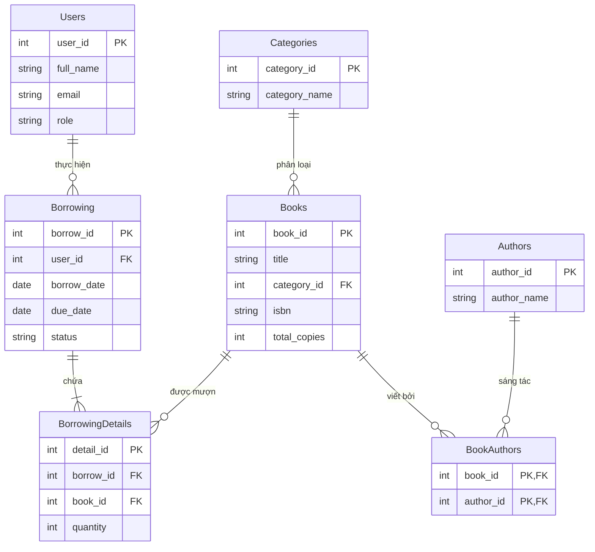

# BÁO CÁO BÀI TẬP THỰC HÀNH TUẦN 3 & 4
## Chủ đề: Thiết kế Cơ sở Dữ liệu & Thao tác SQL với sự hỗ trợ của AI

- **Thư mục bài làm**: `baocaotuan3_4/`
- **Hệ quản trị CSDL áp dụng**: MySQL 8.0+

---

## BÀI TẬP 1: Thiết kế Database cho Hệ thống Quản lý Thư viện (Library Management System)

### 1. Prompt sử dụng cho AI
```text
Bạn là một Chuyên gia Thiết kế Cơ sở Dữ liệu RDBMS. 
Hãy thiết kế cơ sở dữ liệu MySQL chuẩn cho "Hệ thống Quản lý Thư viện (Library Management System)".

Hệ thống cần quản lý các đối tượng chính:
1. Books (Sách)
2. Authors (Tác giả)
3. Categories (Thể loại)
4. Users (Độc giả / Người dùng)
5. Borrowing (Phiếu mượn / trả)

Yêu cầu chi tiết:
- Đảm bảo các bảng có Khóa chính (Primary Key), Khóa ngoại (Foreign Key) hợp lý.
- Xử lý quan hệ Nhiều - Nhiều giữa Books và Authors qua bảng trung gian BookAuthors.
- Bảng Borrowing bao gồm thông tin chi tiết các sách được mượn trong từng lượt mượn (qua bảng BorrowingDetails).
- Trình bày mã SQL CREATE TABLE chuẩn MySQL (engine=InnoDB, utf8mb4) và vẽ sơ đồ ERD dạng Mermaid.
```

### 2. Kết quả AI trả về (Các bảng & Thuộc tính)
- **Categories**: `category_id` (PK), `category_name`, `description`, `created_at`
- **Authors**: `author_id` (PK), `author_name`, `email`, `bio`, `created_at`
- **Books**: `book_id` (PK), `title`, `category_id` (FK), `isbn`, `publish_year`, `total_copies`, `available_copies`
- **BookAuthors**: `book_id` (FK), `author_id` (FK) - PK kép (`book_id`, `author_id`)
- **Users**: `user_id` (PK), `full_name`, `email`, `phone`, `address`, `role`, `status`
- **Borrowing**: `borrow_id` (PK), `user_id` (FK), `borrow_date`, `due_date`, `return_date`, `status`
- **BorrowingDetails**: `detail_id` (PK), `borrow_id` (FK), `book_id` (FK), `quantity`

*Mã SQL chi tiết đã được khởi tạo tại file `baitap1_library.sql` trong thư mục `baocaotuan3_4`.*

### 3. Sơ đồ ERD (Mermaid Code & Hình ảnh)


*Sơ đồ ERD dạng hình ảnh đính kèm: `erd_library.png`.*

### 4. Giải thích chi tiết các mối quan hệ
1. **Categories - Books (1 - N)**: Một thể loại chứa nhiều cuốn sách. Mỗi cuốn sách thuộc về 1 thể loại duy nhất (khóa ngoại `category_id` trong `Books`).
2. **Books - Authors (N - N)**: Một sách có thể gồm nhiều tác giả đồng sáng tác, một tác giả có thể viết nhiều sách. Được giải quyết bằng bảng trung gian `BookAuthors` chứa cặp khóa `(book_id, author_id)`.
3. **Users - Borrowing (1 - N)**: Một độc giả có thể tạo nhiều phiếu mượn sách qua các thời điểm khác nhau (`user_id` làm khóa ngoại trong `Borrowing`).
4. **Borrowing - BorrowingDetails - Books (1 - N - 1)**: Mỗi đợt mượn sách (`Borrowing`) có thể chọn mượn nhiều cuốn sách khác nhau (`Books`). Bảng `BorrowingDetails` giúp lưu chính xác từng đầu sách và số lượng mượn tương ứng.

---

## BÀI TẬP 2: Sinh Database cho Hệ thống Đăng ký Học phần (Course Registration System)

### 1. Prompt sử dụng cho AI
```text
Bạn là chuyên gia thiết kế CSDL. Hãy thiết kế cơ sở dữ liệu cho "Hệ thống Đăng ký học phần (Course Registration System)".

Yêu cầu bắt buộc:
1. Có ít nhất 5 bảng.
2. Thiết kế chuẩn hóa đạt Chuẩn 3NF (Third Normal Form).
3. Đầy đủ Khóa chính (Primary Key - PK) và Khóa ngoại (Foreign Key - FK).
4. Phân tích chi tiết các bước chuẩn hóa từ 1NF, 2NF đến 3NF.
```

### 2. Kết quả AI trả về (5 Bảng đạt Chuẩn 3NF)
1. **`Semesters`** (Học kỳ): `semester_id` (PK), `semester_name`, `academic_year`, `start_date`, `end_date`
2. **`Students`** (Sinh viên): `student_id` (PK), `student_code`, `full_name`, `email`, `phone`, `major`
3. **`Courses`** (Môn học): `course_id` (PK), `course_code`, `course_name`, `credits`, `description`
4. **`CourseSections`** (Lớp học phần): `section_id` (PK), `course_id` (FK), `semester_id` (FK), `section_code`, `lecturer_name`, `room`, `max_capacity`
5. **`Registrations`** (Đăng ký học phần): `registration_id` (PK), `student_id` (FK), `section_id` (FK), `registration_date`, `status`, `grade`

### 3. Giải thích chi tiết quá trình Chuẩn hóa 3NF
- **Chuẩn 1NF (First Normal Form)**: Đảm bảo mọi cột đều chứa giá trị nguyên tố (Atomic values), không chứa mảng hay chuỗi chứa danh sách các môn đăng ký. Mỗi dòng đại diện cho một bản ghi duy nhất.
- **Chuẩn 2NF (Second Normal Form)**: Đạt 1NF và loại bỏ phụ thuộc một phần (Partial Dependency). Mọi thuộc tính không phải khóa chính phải phụ thuộc hoàn toàn vào toàn bộ khóa chính. Ví dụ: Thông tin giảng viên/phòng học được đưa vào bảng `CourseSections` phụ thuộc vào `section_id`, không để trong bảng `Registrations`.
- **Chuẩn 3NF (Third Normal Form)**: Đạt 2NF và loại bỏ phụ thuộc bắc cầu (Transitive Dependency). Tên môn học và số tín chỉ chỉ phụ thuộc vào `course_id`; thông tin sinh viên chỉ phụ thuộc vào `student_id`. Bảng `Registrations` chỉ lưu trữ mối liên kết giữa `student_id` và `section_id` cùng thông tin điểm số/ngày đăng ký riêng biệt.

---

## BÀI TẬP 3: Viết SQL thực thi (CREATE, INSERT, SELECT, UPDATE, DELETE)

Mã SQL tự viết đầy đủ cho hệ thống Đăng ký học phần (được lưu tại `baitap2_3_4_course_registration.sql`):

### 1. Cú pháp CREATE DATABASE & CREATE TABLE
```sql
CREATE DATABASE IF NOT EXISTS CourseRegistrationDB CHARACTER SET utf8mb4;
USE CourseRegistrationDB;

CREATE TABLE Semesters (
    semester_id INT AUTO_INCREMENT PRIMARY KEY,
    semester_name VARCHAR(50) NOT NULL,
    academic_year VARCHAR(20) NOT NULL,
    start_date DATE, end_date DATE
) ENGINE=InnoDB;

CREATE TABLE Students (
    student_id INT AUTO_INCREMENT PRIMARY KEY,
    student_code VARCHAR(20) NOT NULL UNIQUE,
    full_name VARCHAR(150) NOT NULL,
    email VARCHAR(100) NOT NULL UNIQUE,
    phone VARCHAR(20), major VARCHAR(100)
) ENGINE=InnoDB;

CREATE TABLE Courses (
    course_id INT AUTO_INCREMENT PRIMARY KEY,
    course_code VARCHAR(20) NOT NULL UNIQUE,
    course_name VARCHAR(150) NOT NULL,
    credits INT NOT NULL CHECK (credits > 0)
) ENGINE=InnoDB;

CREATE TABLE CourseSections (
    section_id INT AUTO_INCREMENT PRIMARY KEY,
    course_id INT NOT NULL, semester_id INT NOT NULL,
    section_code VARCHAR(30) NOT NULL UNIQUE,
    lecturer_name VARCHAR(150) NOT NULL, room VARCHAR(50),
    CONSTRAINT fk_cs_course FOREIGN KEY (course_id) REFERENCES Courses(course_id),
    CONSTRAINT fk_cs_semester FOREIGN KEY (semester_id) REFERENCES Semesters(semester_id)
) ENGINE=InnoDB;

CREATE TABLE Registrations (
    registration_id INT AUTO_INCREMENT PRIMARY KEY,
    student_id INT NOT NULL, section_id INT NOT NULL,
    registration_date DATETIME DEFAULT CURRENT_TIMESTAMP,
    status ENUM('REGISTERED', 'CANCELLED', 'COMPLETED') DEFAULT 'REGISTERED',
    grade DECIMAL(4,2),
    CONSTRAINT fk_reg_student FOREIGN KEY (student_id) REFERENCES Students(student_id),
    CONSTRAINT fk_reg_section FOREIGN KEY (section_id) REFERENCES CourseSections(section_id)
) ENGINE=InnoDB;
```

### 2. Cú pháp INSERT (Chèn dữ liệu)
```sql
INSERT INTO Semesters (semester_name, academic_year, start_date, end_date) VALUES
('Học kỳ 1', '2025-2026', '2025-09-01', '2026-01-15');

INSERT INTO Students (student_code, full_name, email, phone, major) VALUES
('SV001', 'Nguyễn Văn An', 'an.nguyen@student.edu.vn', '0901234567', 'Khoa học máy tính'),
('SV002', 'Trần Thị Bích', 'bich.tran@student.edu.vn', '0912345678', 'Công nghệ thông tin');

INSERT INTO Courses (course_code, course_name, credits) VALUES
('CS101', 'Lập trình C cơ bản', 3),
('CS201', 'Cơ sở dữ liệu SQL', 4);
```

### 3. Cú pháp SELECT (Truy vấn)
```sql
-- Truy vấn danh sách tất cả sinh viên
SELECT * FROM Students;

-- Truy vấn các môn học có số tín chỉ >= 4
SELECT course_code, course_name, credits FROM Courses WHERE credits >= 4;
```

### 4. Cú pháp UPDATE (Cập nhật)
```sql
-- Cập nhật điểm cho sinh viên
UPDATE Registrations SET grade = 8.8, status = 'COMPLETED' WHERE student_id = 3 AND section_id = 3;

-- Cập nhật số điện thoại sinh viên
UPDATE Students SET phone = '0988888888' WHERE student_code = 'SV001';
```

### 5. Cú pháp DELETE (Xóa)
```sql
-- Xóa các bản ghi đăng ký bị hủy
DELETE FROM Registrations WHERE status = 'CANCELLED';
```

---

## BÀI TẬP 4: Dùng AI sinh và giải thích các câu lệnh JOIN

### 1. Prompt sử dụng cho AI
```text
Tôi có các bảng trong CSDL Đăng ký học phần: Students, Courses, CourseSections, Registrations.
Hãy sinh giúp tôi các câu lệnh SQL JOIN minh họa cho:
1. INNER JOIN
2. LEFT JOIN
3. RIGHT JOIN
4. GROUP BY kết hợp INNER JOIN (Tính điểm trung bình & tổng tín chỉ tích lũy)

Và giải thích chi tiết kết quả thu được từ mỗi phép JOIN.
```

### 2. Kết quả AI & Giải thích chi tiết

#### Câu lệnh 1: INNER JOIN
```sql
SELECT 
    s.student_code,
    s.full_name AS student_name,
    c.course_name,
    cs.section_code,
    cs.lecturer_name,
    r.registration_date
FROM Registrations r
INNER JOIN Students s ON r.student_id = s.student_id
INNER JOIN CourseSections cs ON r.section_id = cs.section_id
INNER JOIN Courses c ON cs.course_id = c.course_id;
```
- **Giải thích**: `INNER JOIN` trả về tập hợp các dòng thỏa mãn điều kiện nối ở cả bảng trái và bảng phải. Trong bài toán này, kết quả chỉ bao gồm những sinh viên **đã thực sự đăng ký** học phần thành công. Sinh viên chưa đăng ký môn nào sẽ không xuất hiện trong kết quả này.

#### Câu lệnh 2: LEFT JOIN
```sql
SELECT 
    s.student_code,
    s.full_name,
    s.major,
    r.section_id,
    r.status
FROM Students s
LEFT JOIN Registrations r ON s.student_id = r.student_id;
```
- **Giải thích**: `LEFT JOIN` giữ lại toàn bộ bản ghi từ bảng bên trái (`Students`). Nếu sinh viên chưa có dữ liệu đăng ký tương ứng bên bảng `Registrations`, cột `section_id` và `status` sẽ hiển thị giá trị `NULL`. Phép truy vấn này rất hữu ích để tìm danh sách sinh viên chưa thực hiện đăng ký môn học trong kỳ.

#### Câu lệnh 3: RIGHT JOIN
```sql
SELECT 
    c.course_name,
    cs.section_code,
    cs.lecturer_name,
    s.full_name AS student_name,
    r.grade
FROM Registrations r
RIGHT JOIN CourseSections cs ON r.section_id = cs.section_id
INNER JOIN Courses c ON cs.course_id = c.course_id
LEFT JOIN Students s ON r.student_id = s.student_id;
```
- **Giải thích**: `RIGHT JOIN` ưu tiên giữ lại toàn bộ bản ghi từ bảng bên phải (`CourseSections`). Ngay cả khi một Lớp học phần vừa được tạo mới và chưa có bất kỳ sinh viên nào đăng ký, lớp học phần đó vẫn xuất hiện trong kết quả truy vấn với giá trị `student_name` là `NULL`.

#### Câu lệnh 4: GROUP BY kết hợp INNER JOIN
```sql
SELECT 
    s.student_code,
    s.full_name,
    COUNT(r.section_id) AS total_courses_passed,
    SUM(c.credits) AS total_credits,
    ROUND(AVG(r.grade), 2) AS average_grade
FROM Students s
INNER JOIN Registrations r ON s.student_id = r.student_id
INNER JOIN CourseSections cs ON r.section_id = cs.section_id
INNER JOIN Courses c ON cs.course_id = c.course_id
WHERE r.status = 'COMPLETED'
GROUP BY s.student_id, s.student_code, s.full_name;
```
- **Giải thích**: Kết hợp `INNER JOIN` 4 bảng cùng với `GROUP BY` theo `student_id` và các hàm tổng hợp (`COUNT`, `SUM`, `AVG`). Phép truy vấn tổng hợp và tính toán tổng số môn đã đạt, tổng số tín chỉ đã tích lũy cùng với điểm trung bình học tập (GPA) của mỗi sinh viên.
