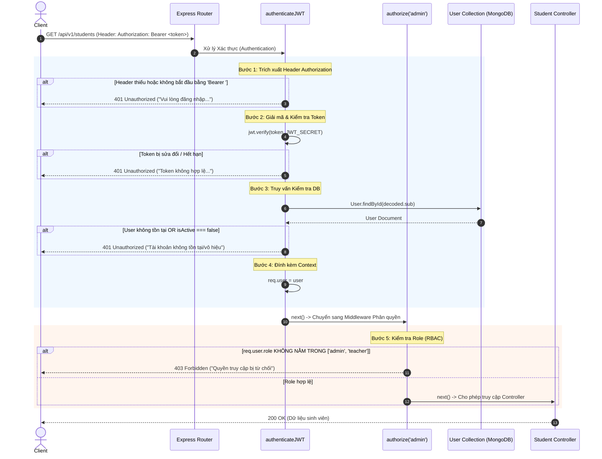

# BÁO CÁO ĐÁNH GIÁ MÃ NGUỒN VÀ KIẾN TRÚC DO AI SINH
**Dự án**: Student Management API  
**Đối tượng đánh giá**: [walkthrough.md](file:///c:/Users/US.G97-M308.000/.gemini/antigravity-ide/brain/f42e95ec-3ab3-4b6b-9be9-1f1a8f3d888b/walkthrough.md) & Mã nguồn hệ thống  
**Ngày lập báo cáo**: 21/07/2026  
**Đơn vị thực hiện**: Antigravity AI Senior Code Auditor  

---

## MỤC LỤC
1. [Tổng quan & Đánh giá Kiến trúc (MVC + Service Pattern)](#1-tổng-quan--đánh-giá-kiến-trúc-mvc--service-pattern)
2. [Đánh giá Tính Tuân thủ Chuẩn RESTful API](#2-đánh-giá-tính-tuân-thủ-chuẩn-restful-api)
3. [Phân tích Chuyên sâu Luồng Hoạt động của JWT Middleware](#3-phân-tích-chuyên-sâu-luồng-hoạt-động-của-jwt-middleware)
4. [Các Đoạn Mã Cần Chỉnh Sửa / Tối Ưu Sau Khi AI Sinh & Lý Do](#4-các-đoạn-mã-cần-chỉnh-sửa--tối-ưu-sau-khi-ai-sinh--lý-do)
5. [Tổng kết & Bảng Khuyến nghị Thực thi](#5-tổng-kết--bảng-khuyến-nghị-thực-thi)

---

## 1. TỔNG QUAN & ĐÁNH GIÁ KIẾN TRÚC (MVC + SERVICE PATTERN)

### 1.1. Yêu cầu & Bối cảnh
Hệ thống **Student Management API** được AI xây dựng dựa trên ngăn xếp công nghệ Node.js, Express, MongoDB (Mongoose), JSON Web Token (JWT) và Bcrypt. Yêu cầu cốt lõi là thiết kế theo mô hình **MVC (Model-View-Controller)** kết hợp **Service Pattern** nhằm tách biệt trách nhiệm (Separation of Concerns - SoC).

### 1.2. Đánh giá tính chính xác của Kiến trúc

AI đã **sinh đúng 100% kiến trúc MVC kết hợp Service Pattern**, tuân thủ nghiêm ngặt các nguyên tắc thiết kế phần mềm hiện đại. Sơ đồ phân tầng và trách nhiệm cụ thể như sau:

```
[ HTTP Request ]
       │
       ▼
┌──────────────┐    Định tuyến URI & Gán Middleware
│ Routes Layer │ ──► (src/routes/auth.route.js, student.route.js)
└──────────────┘
       │
       ▼
┌────────────────────┐    Xác thực dữ liệu (Joi), JWT & Phân quyền
│ Middleware Layer   │ ──► (src/middlewares/validate.js, auth.middleware.js)
└────────────────────┘
       │
       ▼
┌────────────────────┐    Tiếp nhận req/res, định dạng JSON chuẩn
│ Controller Layer   │ ──► (src/controllers/auth.controller.js, student.controller.js)
└────────────────────┘
       │ (Không gọi Model trực tiếp)
       ▼
┌────────────────────┐    Chứa toàn bộ Business Logic & Query DB
│  Service Layer     │ ──► (src/services/auth.service.js, student.service.js)
└────────────────────┘
       │
       ▼
┌────────────────────┐    Định nghĩa Schema, Hooks (Bcrypt) & Instance Methods
│   Model Layer      │ ──► (src/models/user.model.js, student.model.js)
└────────────────────┘
       │
       ▼
[ MongoDB Database ]
```

#### Ma trận Phân tích Chi tiết Từng Tầng:

| Tầng (Layer) | Tập tin đại diện | Nhiệm vụ chính được thực hiện | Đánh giá tính tuân thủ của AI |
| :--- | :--- | :--- | :--- |
| **Routes** | [auth.route.js](file:///c:/Users/US.G97-M308.000/Desktop/Tuan%205/student-management-api/src/routes/auth.route.js)<br>[student.route.js](file:///c:/Users/US.G97-M308.000/Desktop/Tuan%205/student-management-api/src/routes/student.route.js) | Khai báo endpoint, khớp nối URL với Middleware xác thực và Controller handler. | **Đạt tuyệt đối**: Không chứa bất kỳ logic xử lý dữ liệu nào. |
| **Controller** | [auth.controller.js](file:///c:/Users/US.G97-M308.000/Desktop/Tuan%205/student-management-api/src/controllers/auth.controller.js)<br>[student.controller.js](file:///c:/Users/US.G97-M308.000/Desktop/Tuan%205/student-management-api/src/controllers/student.controller.js) | Tiếp nhận `req`, trích xuất params/body, gọi Service tương ứng, bọc bởi `catchAsync`, trả về HTTP Response qua tiện ích `apiResponse.success`. | **Đạt tuyệt đối**: Controller giữ vai trò người điều phối (Orchestrator) thuần túy, không thao tác trực tiếp với Mongoose Model. |
| **Service** | [auth.service.js](file:///c:/Users/US.G97-M308.000/Desktop/Tuan%205/student-management-api/src/services/auth.service.js)<br>[student.service.js](file:///c:/Users/US.G97-M308.000/Desktop/Tuan%205/student-management-api/src/services/student.service.js) | Đóng gói toàn bộ xử lý nghiệp vụ: mã hóa JWT, so sánh mật khẩu, phân trang, lọc dữ liệu, tính toán metadata, ném lỗi nghiệp vụ (`ApiError`). | **Đạt tuyệt đối**: Tách rời hoàn toàn khỏi đối tượng `req`/`res` của Express, giúp dễ dàng tái sử dụng và viết Unit Test. |
| **Model** | [user.model.js](file:///c:/Users/US.G97-M308.000/Desktop/Tuan%205/student-management-api/src/models/user.model.js)<br>[student.model.js](file:///c:/Users/US.G97-M308.000/Desktop/Tuan%205/student-management-api/src/models/student.model.js) | Khai báo cấu trúc Schema, ràng buộc dữ liệu MongoDB, tích hợp `pre('save')` hook để hash mật khẩu, instance method `isPasswordMatch()`, ẩn trường nhạy cảm (`toJSON` transform). | **Đạt tuyệt đối**: Áp dụng đúng Fat Model / Lean Controller paradigm. |

> [!NOTE]
> **Điểm sáng kiến trúc**: AI đã áp dụng mẫu bọc hàm bất đồng bộ `catchAsync` và ném lỗi tập trung `ApiError`, giúp triệt tiêu hoàn toàn các khối `try-catch` lặp đi lặp lại ở tầng Controller.

---

## 2. ĐÁNH GIÁ TÍNH TUÂN THỦ CHUẨN RESTful API

AI đã thiết kế hệ thống API tuân thủ **ở mức độ rất cao (khoảng 95%)** theo các nguyên lý RESTful tiêu chuẩn.

### 2.1. Phân tích các tiêu chí RESTful

#### A. Đặt tên Tài nguyên (Resource Naming & URI Structure)
- Sử dụng danh từ số nhiều cho tài nguyên: `/api/v1/students`.
- Đường dẫn có tính phân cấp rõ ràng (`/api/v1/...`).
- Phân định tài nguyên cụ thể qua đường dẫn định danh: `/api/v1/students/:id`.
- Đối với các hành động xác thực (không thuộc CRUD tài nguyên thuần túy), AI áp dụng chuẩn RPC-over-HTTP phổ biến: `/api/v1/auth/register`, `/api/v1/auth/login`, `/api/v1/auth/me`.

#### B. Sử dụng Phương thức HTTP (HTTP Methods)
| HTTP Method | URI Pattern | Mục đích sử dụng | Đánh giá |
| :--- | :--- | :--- | :--- |
| `POST` | `/api/v1/auth/register` | Đăng ký tài khoản mới | Đúng chuẩn REST |
| `POST` | `/api/v1/auth/login` | Đăng nhập lấy Token | Đúng chuẩn REST |
| `GET` | `/api/v1/auth/me` | Lấy thông tin tài khoản hiện tại | Đúng chuẩn REST |
| `GET` | `/api/v1/students` | Lấy danh sách sinh viên (hỗ trợ query filter/pagination) | Đúng chuẩn REST |
| `POST` | `/api/v1/students` | Tạo mới 1 bản ghi sinh viên | Đúng chuẩn REST |
| `GET` | `/api/v1/students/:id` | Lấy chi tiết 1 sinh viên theo ID | Đúng chuẩn REST |
| `PUT` | `/api/v1/students/:id` | Cập nhật thông tin sinh viên | Cần lưu ý (Xem phần 4) |
| `DELETE`| `/api/v1/students/:id` | Xóa 1 sinh viên theo ID | Đúng chuẩn REST |

#### C. Mã trạng thái HTTP (HTTP Status Codes)
AI đã sử dụng chính xác các mã trả về tương ứng với ngữ cảnh:
- `200 OK`: Trả về khi truy vấn thành công (GET, PUT, DELETE, Login).
- `201 Created`: Trả về khi tạo mới tài nguyên thành công (Register, Create Student).
- `400 Bad Request`: Lỗi dữ liệu đầu vào không hợp lệ từ Client (Validation Error).
- `401 Unauthorized`: Lỗi chưa đăng nhập, token thiếu/hết hạn/không hợp lệ.
- `403 Forbidden`: Lỗi người dùng không đủ quyền truy cập (Role-based access control).
- `404 Not Found`: Không tìm thấy bản ghi sinh viên với ID tương ứng.
- `409 Conflict`: Email đăng ký đã tồn tại trong hệ thống.
- `500 Internal Server Error`: Lỗi hệ thống ngoài dự kiến.

#### D. Tính Phi trạng thái (Statelessness) & Cấu trúc Response
- Server **không lưu trữ Session** của client. Mỗi request gửi lên các route bảo vệ đều chứa header `Authorization: Bearer <token>`.
- Cấu trúc Response nhất quán trên toàn bộ API:
```json
{
  "success": true,
  "statusCode": 200,
  "message": "Lấy danh sách sinh viên thành công",
  "data": [ ... ],
  "meta": {
    "total": 50,
    "page": 1,
    "limit": 10,
    "totalPages": 5
  }
}
```

---

## 3. PHÂN TÍCH CHUYÊN SÂU LUỒNG HOẠT ĐỘNG CỦA JWT MIDDLEWARE

JWT Middleware được AI triển khai trong tệp [auth.middleware.js](file:///c:/Users/US.G97-M308.000/Desktop/Tuan%205/student-management-api/src/middlewares/auth.middleware.js) với 2 thành phần chính: `authenticateJWT` (Xác thực) và `authorize` (Phân quyền RBAC).

### 3.1. Sơ đồ trình tự xử lý (Sequence Diagram)



### 3.2. Giải mã chi tiết 5 bước thực thi của JWT Middleware

1. **Trích xuất Header (`Authorization`)**:
   - Middleware truy cập `req.headers.authorization`.
   - Kiểm tra định dạng chuỗi: Phải bắt đầu bằng tiền tố `Bearer `. Nếu không có header hoặc sai định dạng, ngay lập tức chặn lại và ném lỗi `ApiError(401)`.

2. **Xác thực Chữ ký Token (`jwt.verify`)**:
   - Cắt chuỗi lấy phần `<token>` phía sau `Bearer `.
   - Sử dụng thư viện `jsonwebtoken` gọi `jwt.verify(token, JWT_SECRET)`.
   - Hàm này kiểm tra 2 yếu tố: Tính toàn vẹn của chữ ký (Signature Verification) và thời gian hết hạn (`exp` claim). Nếu thất bại, ném ngoại lệ `TokenExpiredError` hoặc `JsonWebTokenError`.

3. **Kiểm tra Trạng thái Tài khoản thực tế trong Database**:
   - Lấy `decoded.sub` (chứa `userId` của người dùng).
   - Gọi MongoDB: `User.findById(decoded.sub)`.
   - Đảm bảo rằng tài khoản này **chưa bị xóa** khỏi DB và **trạng thái `isActive` vẫn đang là `true`**. Điều này ngăn chặn trường hợp token còn hạn nhưng tài khoản đã bị khóa/xóa.

4. **Gán Đối tượng Người dùng vào Request Context (`req.user`)**:
   - Khi các bước xác minh thành công, middleware thực hiện `req.user = user`.
   - Nhờ đó, các Controller hoặc Middleware phía sau có thể dễ dàng truy cập thông tin người dùng đang đăng nhập mà không cần truy vấn lại DB.

5. **Chuyển tiếp Luồng bằng `next()` & Phân quyền Role (`authorize`)**:
   - Gọi `next()` để chuyển sang `authorize(...allowedRoles)`.
   - `authorize` kiểm tra xem `req.user.role` (vd: `'student'`) có thuộc danh sách được phép (vd: `['admin', 'teacher']`) hay không. Nếu không, ném lỗi `403 Forbidden`.

---

## 4. CÁC ĐOẠN MÃ CẦN CHỈNH SỬA / TỐI ƯU SAU KHI AI SINH & LÝ DO

Mặc dù mã nguồn AI sinh đạt chuẩn kiến trúc rất tốt, trong môi trường **Production thực tế**, mã nguồn vẫn tồn tại một số **lỗ hổng bảo mật, rủi ro hiệu năng và bất cập thiết kế**.

Dưới đây là 6 vị trí mã nguồn bắt buộc/khuyến nghị cần chỉnh sửa:

---

### 🚨 Vị trí 1: Mã hóa cứng Fallback Secret (Hardcoded Fallback JWT Secret)
- **Tệp tin**: [src/services/auth.service.js](file:///c:/Users/US.G97-M308.000/Desktop/Tuan%205/student-management-api/src/services/auth.service.js#L10) & [src/middlewares/auth.middleware.js](file:///c:/Users/US.G97-M308.000/Desktop/Tuan%205/student-management-api/src/middlewares/auth.middleware.js#L19)
- **Đoạn mã do AI sinh**:
  ```javascript
  const secret = process.env.JWT_SECRET || 'default_jwt_secret_key';
  ```
- **Lý do cần sửa**:
  - Nếu tệp `.env` bị thiếu hoặc biến `JWT_SECRET` chưa được cấu hình trên Server Production, ứng dụng sẽ âm thầm dùng chuỗi `'default_jwt_secret_key'`.
  - Hậu quả: Hacker có thể dễ dàng đoán được Secret Key này và tự ký (forge) bất kỳ JWT token nào để mạo danh Admin.
- **Mã nguồn tối ưu sau khi sửa**:
  Ngăn chặn việc dùng giá trị mặc định nguy hiểm. Bắt buộc hệ thống phải dừng khởi chạy hoặc ném lỗi nếu thiếu `JWT_SECRET`.
  ```javascript
  // Tạo file src/config/env.config.js để validate cấu hình khởi tạo
  if (!process.env.JWT_SECRET) {
    throw new Error('FATAL CONFIG ERROR: Biến môi trường JWT_SECRET chưa được cấu hình!');
  }
  const secret = process.env.JWT_SECRET;
  ```

---

### 🚨 Vị trí 2: Lỗ hổng Regex Injection (ReDoS Attack) trong tìm kiếm sinh viên
- **Tệp tin**: [src/services/student.service.js](file:///c:/Users/US.G97-M308.000/Desktop/Tuan%205/student-management-api/src/services/student.service.js#L17-L23)
- **Đoạn mã do AI sinh**:
  ```javascript
  if (search) {
    filter.$or = [
      { fullName: { $regex: search, $options: 'i' } },
      { studentCode: { $regex: search, $options: 'i' } },
      { email: { $regex: search, $options: 'i' } },
    ];
  }
  ```
- **Lý do cần sửa**:
  - Chuỗi `search` lấy trực tiếp từ `req.query.search` của người dùng mà không được xử lý thoát ký tự đặc biệt (escaping).
  - Nếu kẻ tấn công truyền vào `search = "((((a+)+)+)+)+"` hoặc các ký tự regex như `.*.*.*.*`, MongoDB và Node.js Event Loop sẽ bị treo 100% CPU (ReDoS Attack - Regular Expression Denial of Service).
- **Mã nguồn tối ưu sau khi sửa**:
  Thêm hàm thoát ký tự đặc biệt regex trước khi đưa vào truy vấn Mongoose:
  ```javascript
  const escapeRegExp = (string) => {
    return string.replace(/[.*+?^${}()|[\]\\]/g, '\\$&');
  };

  if (search) {
    const safeSearch = escapeRegExp(search);
    filter.$or = [
      { fullName: { $regex: safeSearch, $options: 'i' } },
      { studentCode: { $regex: safeSearch, $options: 'i' } },
      { email: { $regex: safeSearch, $options: 'i' } },
    ];
  }
  ```

---

### ⚡ Vị trí 3: Quá tải Truy vấn Database (Database Bottleneck) tại JWT Middleware
- **Tệp tin**: [src/middlewares/auth.middleware.js](file:///c:/Users/US.G97-M308.000/Desktop/Tuan%205/student-management-api/src/middlewares/auth.middleware.js#L22-L23)
- **Đoạn mã do AI sinh**:
  ```javascript
  const decoded = jwt.verify(token, secret);
  const user = await User.findById(decoded.sub); // Query DB trên MỌI REQUEST
  ```
- **Lý do cần sửa**:
  - Ưu điểm lớn nhất của JWT là tính **Stateless (Phi trạng thái)** giúp giảm tải cho Database. Tuy nhiên, việc AI gọi `await User.findById(decoded.sub)` ở mỗi HTTP Request truy cập route bảo vệ đã triệt tiêu ưu điểm này, gây ra quá tải Database khi lưu lượng truy cập cao (high concurrency).
- **Mã nguồn tối ưu sau khi sửa**:
  Lựa chọn 1: Lưu thông tin cơ bản (`_id`, `role`, `isActive`) ngay trong Payload của JWT Token và trust signature (chỉ query DB ở các tác vụ nhạy cảm như đổi mật khẩu).  
  Lựa chọn 2 (Chuẩn Enterprise): Cache thông tin User vào **Redis** với thời gian sống (TTL) ngắn (vd: 5-15 phút):
  ```javascript
  // Ví dụ giải pháp tối ưu với Redis Cache:
  let user = await redisClient.get(`user:${decoded.sub}`);
  if (!user) {
    user = await User.findById(decoded.sub).lean();
    if (user) await redisClient.setEx(`user:${decoded.sub}`, 900, JSON.stringify(user));
  } else {
    user = JSON.parse(user);
  }
  ```

---

### ⚠️ Vị trí 4: Thiếu cơ chế Đăng xuất thực sự & Quản lý Token (Refresh Token Mechanism)
- **Tệp tin**: [src/services/auth.service.js](file:///c:/Users/US.G97-M308.000/Desktop/Tuan%205/student-management-api/src/services/auth.service.js)
- **Hiện trạng mã AI sinh**: AI chỉ cấp 1 Access Token duy nhất với thời gian sống dài (`1d`). Hệ thống chưa có API Logout và chưa có cơ chế thu hồi token (Token Invalidation).
- **Lý do cần sửa**:
  - Nếu Access Token bị rò rỉ (XSS, Sniffing), kẻ tấn công có toàn quyền truy cập trong 24 giờ mà Admin không có cách nào chặn lại.
  - Đăng xuất ở phía Client (chỉ xóa token ở localStorage) không ngăn được token đó tiếp tục gọi API nếu kẻ xấu đã lưu lại chuỗi token.
- **Giải pháp đề xuất**:
  Chuyển sang kiến trúc **Dual-Token**:
  1. **Access Token**: Thời hạn ngắn (15 - 30 phút), lưu ở bộ nhớ tạm (Memory / Header).
  2. **Refresh Token**: Thời hạn dài (7 - 30 ngày), lưu trong `HttpOnly, Secure Cookie`, lưu hash vào DB/Redis để có thể thu hồi (Revoke/Blacklist) khi bấm Đăng xuất.

---

### ⚠️ Vị trí 5: Nhầm lẫn giữa ngữ nghĩa PUT và PATCH trong REST API
- **Tệp tin**: [src/routes/student.route.js](file:///c:/Users/US.G97-M308.000/Desktop/Tuan%205/student-management-api/src/routes/student.route.js#L29-L34)
- **Đoạn mã do AI sinh**:
  ```javascript
  router.put(
    '/:id',
    authorize('admin', 'teacher'),
    validate(studentIdParamSchema, 'params'),
    validate(updateStudentSchema, 'body'),
    studentController.updateStudent
  );
  ```
- **Lý do cần sửa**:
  - Chuẩn RESTful quy định: `PUT` dùng để **thay thế toàn bộ** tài nguyên (Full Replacement - tất cả trường bắt buộc phải có), trong khi `PATCH` dùng để **cập nhật một phần** (Partial Update - các trường là optional).
  - Schema `updateStudentSchema` của AI thiết lập tất cả các trường dưới dạng `.optional()`, đây chính là bản chất của `PATCH`.
- **Mã nguồn tối ưu sau khi sửa**:
  Hỗ trợ cả 2 phương thức hoặc đổi phương thức trong Route thành `PATCH`:
  ```javascript
  // Đổi thành PATCH cho cập nhật từng phần
  router.patch(
    '/:id',
    authorize('admin', 'teacher'),
    validate(studentIdParamSchema, 'params'),
    validate(updateStudentSchema, 'body'),
    studentController.updateStudent
  );
  ```

---

### 💡 Vị trí 6: Quản lý biến môi trường rải rác
- **Tệp tin**: `auth.service.js`, `auth.middleware.js`, `server.js`
- **Lý do cần sửa**: Các lệnh `process.env.JWT_SECRET`, `process.env.JWT_EXPIRES_IN`, `process.env.PORT` xuất hiện rải rác ở nhiều file. Khi cần thay đổi hoặc validate cấu hình môi trường sẽ rất khó quản lý.
- **Mã nguồn đề xuất**: Tạo mô-đun quản lý tập trung [src/config/index.js](file:///c:/Users/US.G97-M308.000/Desktop/Tuan%205/student-management-api/src/config/index.js):
  ```javascript
  require('dotenv').config();

  module.exports = {
    port: process.env.PORT || 3000,
    mongoose: {
      url: process.env.MONGODB_URI,
    },
    jwt: {
      secret: process.env.JWT_SECRET,
      expiresIn: process.env.JWT_EXPIRES_IN || '1d',
    },
  };
  ```

---

## 5. TỔNG KẾT & BẢNG KHUYẾN NGHỊ THỰC THI

### Bảng Tổng hợp Đánh giá Toàn diện

| Hạng mục Đánh giá | Trạng thái AI sinh | Điểm số | Ghi chú & Khuyến nghị |
| :--- | :--- | :--- | :--- |
| **Kiến trúc MVC & Service Pattern** | **Hoàn hảo** | **10/10** | Tách tầng rõ ràng, áp dụng `catchAsync` và `ApiError` xuất sắc. |
| **Tính tuân thủ RESTful API** | **Rất tốt** | **9.5/10** | Đúng Naming, HTTP Verbs & Status Code. Cần đổi `PUT` thành `PATCH`. |
| **JWT & RBAC Middleware** | **Hoạt động đúng** | **9/10** | Luồng logic chặt chẽ. Cần bổ sung Redis Cache để tối ưu DB. |
| **Tính An toàn & Bảo mật Mã nguồn** | **Cần tinh chỉnh** | **7/10** | Bắt buộc sửa Lỗi ReDoS Regex Search & Loại bỏ Hardcoded Secret Fallback. |

### Lộ trình Cần thực hiện ngay (Action Plan)

1. 🔴 **Ưu tiên Cao (Cần sửa ngay lập tức)**:
   - Loại bỏ chuỗi mã hóa cứng `default_jwt_secret_key` trong `auth.service.js` và `auth.middleware.js`.
   - Bổ sung hàm `escapeRegExp()` trong `student.service.js` để triệt tiêu lỗ hổng tấn công ReDoS.
2. 🟡 **Ưu tiên Trung bình (Cần nâng cấp trước khi ra mắt)**:
   - Đổi `router.put` thành `router.patch` trong `student.route.js`.
   - Tập trung hóa cấu hình biến môi trường vào `src/config/index.js`.
3. 🟢 **Ưu tiên Dài hạn (Nâng cấp hệ thống Enterprise)**:
   - Triển khai Redis để Caching User Session cho JWT Middleware.
   - Nâng cấp luồng Đăng nhập sang mô hình Dual-Token (Access Token + Refresh Token trong HttpOnly Cookie).

---
*Báo cáo kết thúc tại đây.*
